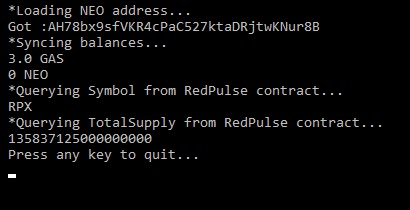
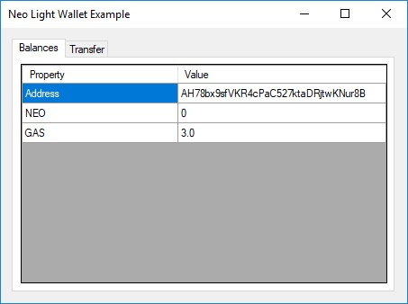

<p align="center">
  
</p>

<h1 align="center">NEO Lux</h1>

<p align="center">
  NEO light wallet / blockchain API for C#.
</p>

## Contents

- [Description](#description)
- [Compatibility](#compatibility)
- [Installation](#installation)
- [Usage](#usage)
- [Console Demo](#console-demo)
- [Light Wallet Demo](#light-wallet-demo)
- [Unity Support](#unity-support)
- [TODO](#todo)
- [Credits and License](#credits-and-license)

---

## Description

**NEO Lux** was developed to provide an easy way to interact with Smart Contracts in the NEO blockchain using C#. 

A full node is not necessary, but you can have one running locally and connect to it using NEO Lux.

## Compatibility

Platform 		| Status
:---------------------- | :------------
.NET framework 		| Working
UWP 			| Working
Mono 			| Working
Xamarin / Mobile 	| Untested
Unity 			| Working


## Installation

    PM> Install-Package NeoLux

# Usage

Import the package:

```c#
using NeoLux;
```

For invoking a Smart Contract, e.g.:

```c#
	var privKey = "XXXXXXXXXXXXXXXXprivatekeyhereXXXXXXXXXXX".HexToBytes();	 // can be any valid private key
	var myKeys = new KeyPair(privKey);
	var scriptHash = "de1a53be359e8be9f3d11627bcca40548a2d5bc1"; // the scriptHash of the smart contract you want to use	
	// for now, contracts must be in the format Main(string operation, object[] args)
	var api = NeoRPC.ForMainNet();
	var result = api.CallContract(myKeys, scriptHash, "registerMailbox", new object[] { "ABCDE", "demo@phantasma.io" });
```

For transfering assets (NEO or GAS), e.g.:

```c#
	var privKey = "XXXXXXXXXXXXXXXXprivatekeyhereXXXXXXXXXXX".HexToBytes();	 
	// can be any valid private key in raw format, for WIF use KeyPair.FromWIF
	var myKeys = new KeyPair(privKey);
	// WARNING: For now use test net only, this code is experimental, you could lose real assets if using main net
	var api = NeoRPC.ForTestNet();
	var result = api.SendAsset("AanTL6pTTEdnphXpyPMgb7PSE8ifSWpcXU" /*destination address*/, "GAS", 3 /*amount to send */ , myKeys);
```

For getting the balance of an address:

```c#
	var api = NeoRPC.ForTestNet();
	var balances = api.GetBalancesOf("AYpY8MKiJ9q5Fpt4EeQQmoYRHxdNHzwWHk");
	foreach (var entry in balances)
	{
		Console.WriteLine(entry.Key + " => " + entry.Value);
	}
```

# NEP5 Token support

Neo-Lux allows to abstract interaction with Neo tokens via the NEP5 C# class.

Here's an example of interaction with a NEP5 token:

```c#
	var api = NeoRPC.ForMainNet(); 
	var redPulse_token = api.GetToken("RPX");	
	Console.WriteLine($"{redPulse_token.Name} ({redPulse_token.Symbol})");
	Console.WriteLine($"Total Supply: {redPulse_token.TotalSupply} ({redPulse_token.Symbol})");
	
	// you can also request transfers of tokens
	var privKey = "XXXXXXXXXXXXXXXXprivatekeyhereXXXXXXXXXXX".HexToBytes();	 // can be any valid private key
	var myKeys = new KeyPair(privKey);
	redPulse_token.Transfer(myKeys, "AanTL6pTTEdnphXpyPMgb7PSE8ifSWpcXU" /*destination*/, 123 /*amount to send*/); 
```

You can also instantiate a NEP5 token from a script hash.

Look up the script hashes [here](https://neotracker.io/browse/asset/1) or use your own if you're developing your own NEP5 token.

```c#
	var api = NeoRPC.ForMainNet(); 	
	var redPulse_contractHash = "ecc6b20d3ccac1ee9ef109af5a7cdb85706b1df9";
	var redPulse_token = new NEP5(api, redPulse_contractHash);
```	

# Console Demo

A console program is included to demonstrate common features:
+ Loading private keys
+ Obtaining wallet address from private key
+ Query balance from an address
+ Invoking a NEP5 Smart Contract (query symbol and total supply)



# Light Wallet Demo

A winforms demo is included to showcase how simple is to create a light wallet.

The light wallet demo is able to login into any wallet by inserting a private key in either raw format or WIF format, and also to transfer funds (NEO or GAS) to any address.

Please beware of using this wallet to transfer funds in Neo main net, as this wallet was created just for demonstration purpose and not exhaustively tested.

City of Zion cannot be responsibilized for loss of funds caused by using this light wallet.



# Unity Support

NEOLux can be used together with Unity to make games that interact with the NEO blockchain.
A Unity demo showcasing loading a NEO wallet and querying the balance is included.

Use caution, as most NEOLux methods are blocking calls; in Unity the proper way to call them is using [Coroutines](https://docs.unity3d.com/Manual/Coroutines.html).
```c#
    IEnumerator SyncBalance()
    {
        var balances = NeoAPI.GetBalance(NeoAPI.Net.Test, this.keys.address);
        this.balance = balances["NEO"];
    }
	
	// Then you call the method like this
	StartCoroutine(SyncBalance());
```

## Using with Unity

Don't drop the source code of NEOLux inside Unity, it won't work. Instead of the provided .UnityPackage file to install it (or use the included Demo project as a template for your project).

If you have weird compilation errors inside Unity, try the project "Api Compatibility Level" to .NET 4.6.


# Credits and License

Created by Sérgio Flores (<http://lunarlabs.pt/>).

Credits also go to the other devs of City Of Zion(<http://cityofzion.io/>), as this project started as a port of code from their [NEON wallet](https://github.com/CityOfZion/neon-wallet) from Javascript to C#.
Of course, credits also go to the NEO team(<http://neo.org>), as I also used some code from their [NEO source](https://github.com/neo-project/neo).

This project is released under the MIT license, see `LICENSE.md` for more details.
